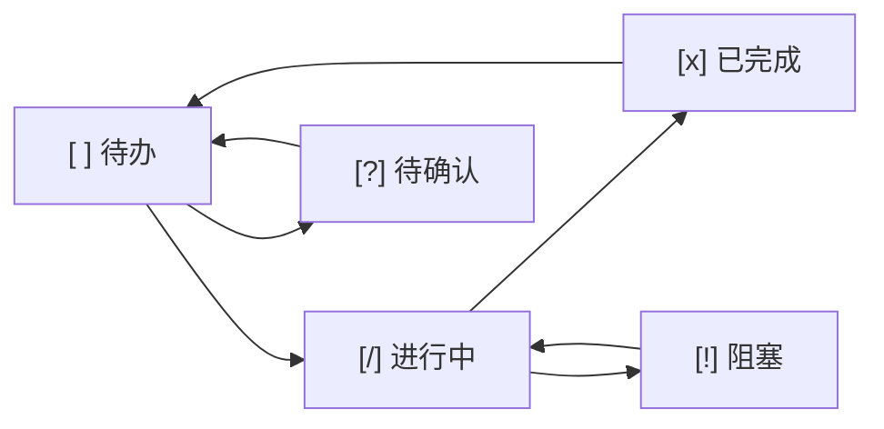
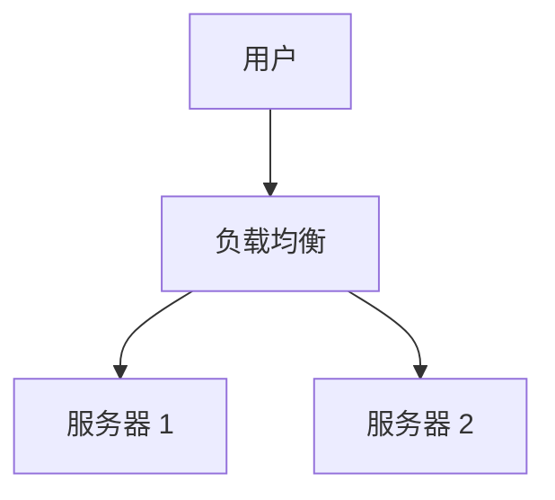

# Project-Doc Plugin Implementation Plan

> **For agentic workers:** REQUIRED SUB-SKILL: Use superpowers:subagent-driven-development (recommended) or superpowers:executing-plans to implement this plan task-by-task. Steps use checkbox (`- [ ]`) syntax for tracking.

**Goal:** 创建一个完整的 Claude Code 插件 project-doc，实现文档归档和任务追踪功能。

**Architecture:** 插件采用规则 + 技能 + 模板的组合架构。规则定义"做什么"（MANDATORY 规范），技能定义"怎么做"（执行流程），模板提供标准格式。集成规则文件实现与现有工作流的自动补全。

**Tech Stack:** Claude Code Plugin System (plugin.json, rules, skills, templates)

---

## File Structure

```
/Users/apple/Documents/workspace/rule/project-doc/
├── plugin.json                    # 插件配置文件
├── README.md                      # 安装和使用说明
├── rules/
│   ├── documentation.md           # 文档归档规则
│   ├── task-tracking.md           # 任务追踪规则
│   └── project-doc-integration.md # 集成规则
├── skills/
│   ├── project-init/
│   │   └── SKILL.md               # 项目初始化技能
│   ├── requirement-change/
│   │   └── SKILL.md               # 需求变更管理技能
│   ├── task-update/
│   │   └── SKILL.md               # 任务状态更新技能
│   └── doc-sync/
│       └── SKILL.md               # 文档同步技能
└── templates/
    ├── DOC_INDEX.md               # 文档索引模板
    ├── TASK_TRACKER.md            # 任务追踪模板
    ├── CHANGELOG.md               # 变更追溯模板
    ├── REQ_template.md            # 需求文档模板
    ├── ARCH_template.md           # 架构设计模板
    ├── TECH_template.md           # 技术文档模板
    └── MOM_template.md            # 会议纪要模板
```

---

## Task 1: 创建插件目录结构

**Files:**
- Create: `project-doc/` (目录)
- Create: `project-doc/rules/` (目录)
- Create: `project-doc/skills/` (目录)
- Create: `project-doc/skills/project-init/` (目录)
- Create: `project-doc/skills/requirement-change/` (目录)
- Create: `project-doc/skills/task-update/` (目录)
- Create: `project-doc/skills/doc-sync/` (目录)
- Create: `project-doc/templates/` (目录)

- [ ] **Step 1: 创建所有目录**

```bash
mkdir -p /Users/apple/Documents/workspace/rule/project-doc/rules
mkdir -p /Users/apple/Documents/workspace/rule/project-doc/skills/project-init
mkdir -p /Users/apple/Documents/workspace/rule/project-doc/skills/requirement-change
mkdir -p /Users/apple/Documents/workspace/rule/project-doc/skills/task-update
mkdir -p /Users/apple/Documents/workspace/rule/project-doc/skills/doc-sync
mkdir -p /Users/apple/Documents/workspace/rule/project-doc/templates
```

---

## Task 2: 创建 plugin.json 配置文件

**Files:**
- Create: `project-doc/plugin.json`

- [ ] **Step 1: 创建 plugin.json**

```json
{
  "name": "project-doc",
  "version": "1.0.0",
  "description": "文档归档和任务追踪插件 - 解决项目文档管理混乱问题",
  "author": "Claude + User",
  "rules": ["rules/documentation.md", "rules/task-tracking.md", "rules/project-doc-integration.md"],
  "skills": {
    "project-init": {
      "path": "skills/project-init/SKILL.md",
      "userInvocable": true,
      "description": "初始化项目文档目录结构"
    },
    "requirement-change": {
      "path": "skills/requirement-change/SKILL.md",
      "userInvocable": true,
      "description": "管理需求变更并记录追溯"
    },
    "task-update": {
      "path": "skills/task-update/SKILL.md",
      "userInvocable": false,
      "description": "自动更新任务状态（规则驱动）"
    },
    "doc-sync": {
      "path": "skills/doc-sync/SKILL.md",
      "userInvocable": false,
      "description": "自动同步文档状态（规则驱动）"
    }
  },
  "templates": [
    "templates/DOC_INDEX.md",
    "templates/TASK_TRACKER.md",
    "templates/CHANGELOG.md",
    "templates/REQ_template.md",
    "templates/ARCH_template.md",
    "templates/TECH_template.md",
    "templates/MOM_template.md"
  ]
}
```

---

## Task 3: 创建 README.md 安装说明

**Files:**
- Create: `project-doc/README.md`

- [ ] **Step 1: 创建 README.md**

```markdown
# Project-Doc Plugin

文档归档和任务追踪插件，解决以下痛点：
- 需求散落、变更无追溯
- 任务遗漏、进度不透明
- 文档位置混乱、分类不清

## 安装方法

### 方法 1: 直接复制
```bash
cp -r project-doc ~/.claude/plugins/project-doc
```

### 方法 2: 符号链接（推荐，便于更新）
```bash
ln -s /path/to/project-doc ~/.claude/plugins/project-doc
```

## 使用方法

### 手动触发技能
- `/project-init` - 初始化项目文档目录
- `/req-change` - 发起需求变更并记录

### 自动触发（规则驱动）
- 任务开始/完成时自动更新 TASK_TRACKER.md
- 代码变更后自动检查文档状态

## 文档目录结构

```
docs/
├── 01-requirements/     # 需求文档
├── 02-design/           # 设计文档
├── 03-technical/        # 技术文档
├── 04-management/       # 管理文档（任务追踪、变更记录）
├── 05-archive/          # 归档文档
└── DOC_INDEX.md         # 文档索引入口
```

## 与现有规则集成

本插件通过 `project-doc-integration.md` 自动补全现有工作流：
- Plan First 阶段：创建文档目录结构
- Commit & Push 阶段：更新任务状态和变更记录

无需修改你现有的规则文件。
```

---

## Task 4: 创建 documentation.md 规则文件

**Files:**
- Create: `project-doc/rules/documentation.md`

- [ ] **Step 1: 创建 documentation.md**

```markdown
# Documentation Standards

> 本文件定义项目文档归档规范，确保文档统一管理、易于追溯、AI 可理解。

## 文档目录结构 (MANDATORY)

所有项目文档必须按以下结构组织：

```
docs/
├── 01-requirements/     # 需求定义、PRD、用户故事
├── 02-design/           # 架构设计、API 设计、UI/UX、数据库设计
├── 03-technical/        # 环境搭建、部署手册、核心逻辑说明
├── 04-management/       # 会议纪要、变更追溯、任务追踪
├── 05-archive/          # 历史废弃版本
└── DOC_INDEX.md         # 文档总索引（入口）
```

**目录职责说明：**

| 目录 | 职责 | 典型文档 |
|------|------|----------|
| 01-requirements | 解决"做什么" | PRD、用户故事、业务流程图、产品路线图 |
| 02-design | 解决"怎么做" | 系统架构、API 规范、UI/UX 设计、数据库建模 |
| 03-technical | 解决"如何用" | 环境搭建、部署手册、Troubleshooting、核心算法说明 |
| 04-management | 解决"谁在做/改了什么" | 会议纪要、任务追踪、变更追溯 |
| 05-archive | 解决"历史记录" | 废弃的需求版本、过时的设计文档 |

## 文档命名规范 (MANDATORY)

**格式：** `[序号]_[类型简写]_[描述关键词]_[日期/版本].md`

**类型简写列表：**

| 简写 | 全称 | 用途 | 示例 |
|------|------|------|------|
| REQ | Requirement | 需求文档 | 01_REQ_UserAuth_v1.0.md |
| ARCH | Architecture | 架构设计 | 02_ARCH_SystemOverview.md |
| API | API Specification | API 接口规范 | 02_API_RestEndpoints.md |
| UI | UI/UX Design | UI/UX 设计 | 02_UI_LoginFlow.md |
| DB | Database | 数据库设计 | 02_DB_Schema.md |
| TECH | Technical | 技术文档 | 03_TECH_SetupGuide_Mac.md |
| MOM | Minutes of Meeting | 会议纪要 | 04_MOM_SprintPlanning_20231025.md |
| REVIEW | Review Report | Review 报告 | 04_REVIEW_CodeQuality.md |

**命名原则：**
- 唯一性：同一目录下文件名不重复
- 可排序：序号前缀确保按类型排序
- 可预测：通过命名即可判断文档类型和用途
- 无空格：使用下划线或连字符替代空格

## 文档总索引 (DOC_INDEX.md)

每个项目必须在 `docs/` 下维护 `DOC_INDEX.md`，作为文档入口。

**DOC_INDEX.md 必须包含：**
1. 项目名称和简介
2. 快速导航：链接到各目录下的核心文档
3. 命名与归档规范汇总
4. Claude Code 上下文读取指令

## 文档生命周期管理

| 生命周期阶段 | 操作 | 说明 |
|-------------|------|------|
| 新建 | 按分类存入对应目录 | 使用标准命名格式 |
| 更新 | 更新 DOC_INDEX.md 索引 | 确保索引与实际文件一致 |
| 版本升级 | 追加版本号或日期 | 如 v1.0 → v1.1 或追加日期 |
| 废弃 | 移动至 05-archive | 文件顶部标注 `[DEPRECATED]` 及废弃原因 |

## Claude Code 执行指令 (MANDATORY)

**代码变更前：**
- 必须先查阅 `docs/01-requirements/` 下的相关 PRD 或需求文档
- 确认需求理解正确后再开始实现

**功能完成后：**
- 同步更新 `docs/04-management/TASK_TRACKER.md` 任务状态
- 如涉及需求变更，记录到 `docs/04-management/CHANGELOG.md`

**新建项目时：**
- 使用 `/project-init` 技能创建标准文档目录结构
- 生成初始 `DOC_INDEX.md` 模板

## 文档质量检查清单

在提交代码前，检查文档状态：

- [ ] 新功能是否有对应需求文档
- [ ] 需求文档是否已链接到 DOC_INDEX.md
- [ ] 变更是否已记录到 CHANGELOG.md
- [ ] 任务状态是否已更新到 TASK_TRACKER.md
- [ ] 废弃文档是否已移动至 05-archive
```

---

## Task 5: 创建 task-tracking.md 规则文件

**Files:**
- Create: `project-doc/rules/task-tracking.md`

- [ ] **Step 1: 创建 task-tracking.md**

```markdown
# Task Tracking Standards

> 本文件定义项目内任务追踪规范，确保进度透明、状态可追溯。

## 任务追踪文件位置 (MANDATORY)

- **主文件：** `docs/04-management/TASK_TRACKER.md`
- **任务详情：** 可在 `docs/04-management/tasks/` 下创建单任务详情文件

## 任务状态标识 (MANDATORY)

| 状态标识 | 含义 | 使用场景 |
|----------|------|----------|
| `[ ]` | 待办 | 任务已规划，尚未开始 |
| `[/]` | 进行中 | 任务正在执行 |
| `[x]` | 已完成 | 任务已完成，已验证 |
| `[!]` | 阻塞 | 任务遇到障碍，需外部干预 |
| `[?]` | 待确认 | 任务细节不明确，需澄清 |

## 任务记录格式 (MANDATORY)

```markdown
| ID | 任务描述 | 负责人 | 优先级 | 状态 | 关联需求 | 备注 |
|:----|:---------|:-------|:-------|:-----|:---------|:-----|
| T-001 | 实现用户登录功能 | Claude | P0 | [ ] 待办 | REQ-001 | 需配合 JWT |
```

**字段说明：**

| 字段 | 说明 | 格式要求 |
|------|------|----------|
| ID | 任务唯一标识 | T-NNN 格式，如 T-001 |
| 任务描述 | 简明扼要描述任务目标 | 不超过 30 字 |
| 负责人 | 任务执行者 | 具体人员名或 AI-Dev |
| 优先级 | 任务紧迫程度 | P0(紧急)/P1(高)/P2(中)/P3(低) |
| 状态 | 当前执行状态 | 使用标准状态标识 |
| 关联需求 | 关联的需求文档 ID | 如 REQ-001 |
| 备注 | 补充说明 | 可选，如阻塞原因、进度百分比 |

## 任务生命周期流程



## Claude Code 执行指令 (MANDATORY)

**开始任务时：**
- 先读取 `docs/04-management/TASK_TRACKER.md` 确认当前任务状态
- 更新状态为 `[/]` 进行中
- 确认任务详情后再开始实现

**任务执行中：**
- 遇到阻塞：立即更新状态为 `[!]` 阻塞，说明阻塞原因
- 需要澄清：更新状态为 `[?]` 待确认，列出需要确认的问题

**完成任务后：**
- 必须更新状态为 `[x]` 已完成
- 填写关联 Commit 或 PR 链接

**任务状态检查时机：**
- 每次开始工作时：检查当前任务状态
- 每次中断工作时：更新当前任务状态和进度
- 每次提交代码时：确认任务状态已更新

## 任务详情文件模板

对于复杂任务，可在 `docs/04-management/tasks/` 下创建详情文件：

```markdown
# T-001: [任务标题]

## 基本信息
- **关联需求**: REQ-001
- **优先级**: P0
- **负责人**: Claude
- **预计工时**: 2h

## 任务描述
[详细描述任务目标和背景]

## 实现计划
1. [子任务 1]
2. [子任务 2]
3. [子任务 3]

## 技术要点
- [关键技术点 1]
- [关键技术点 2]

## 验收标准
- [ ] [验收标准 1]
- [ ] [验收标准 2]

## 执行日志
- YYYY-MM-DD HH:MM: 开始执行
- YYYY-MM-DD HH:MM: 完成子任务 1
```

## 与现有规则集成

本规则与以下规则协作：
- [development-workflow](../common/development-workflow.md): 任务规划阶段使用 planner agent
- [documentation](./documentation.md): 文档归档规范
```

---

## Task 6: 创建 project-doc-integration.md 集成规则

**Files:**
- Create: `project-doc/rules/project-doc-integration.md`

- [ ] **Step 1: 创建 project-doc-integration.md**

```markdown
# Project-Doc Integration Rules

> 本文件定义 project-doc 插件与现有开发工作流的集成指令。
> 安装插件后自动生效，无需修改现有规则文件。

## 与 Development Workflow 集成

在执行 development-workflow 的各阶段时，同步执行以下指令：

### 阶段 0：Research & Reuse
- **无额外指令**，按现有规则执行

### 阶段 1：Plan First
**新增指令 (MANDATORY)：**
1. 使用 `/project-init` 技能创建标准文档目录结构
2. 将规划文档按 [documentation.md](./documentation.md) 规范存放：
   - PRD → `docs/01-requirements/`
   - Architecture → `docs/02-design/`
   - Tech Doc → `docs/03-technical/`
3. 更新 `docs/DOC_INDEX.md` 索引

### 阶段 2：TDD Approach
**新增指令 (MANDATORY)：**
1. 开始编写测试前，先读取 `docs/01-requirements/` 下的相关需求文档
2. 确认测试覆盖的需求点

### 阶段 3：Code Review
**新增指令 (MANDATORY)：**
1. Review 时检查文档状态：
   - 新功能是否有需求文档支撑
   - 需求文档是否已链接到 DOC_INDEX.md

### 阶段 4：Commit & Push
**新增指令 (MANDATORY)：**
1. 更新 `docs/04-management/TASK_TRACKER.md` 任务状态
2. 如涉及需求变更，记录到 `docs/04-management/CHANGELOG.md`
3. 提交消息中引用任务 ID（如 `feat: add login (T-001)`）

## 与 Git Workflow 集成

在执行 git-workflow 时，同步执行以下指令：

### Commit Message Format
**扩展格式：**
```
<type>: <description> (TASK_ID)

<optional body>
```

示例：
```
feat: add user login feature (T-001)

- Implement JWT authentication
- Add login UI component

Relates: REQ-001, T-001
```

### Pull Request Workflow
**新增指令 (MANDATORY)：**
1. PR 描述中包含：
   - 关联需求 ID（如 `Relates: REQ-001`）
   - 任务 ID（如 `Task: T-001`）
   - 变更说明（如有需求变更）
2. PR 合并前检查文档更新状态

## 与 Agents 集成

在使用 agents 时，新增以下代理职责：

### planner agent
- 创建文档目录结构（调用 project-init 技能）
- 生成文档索引 DOC_INDEX.md

### code-reviewer agent
- 检查文档状态：需求文档是否存在、是否已归档
- 检查变更追溯：CHANGELOG.md 是否已更新

### doc-updater agent
- 更新 DOC_INDEX.md 索引
- 更新 TASK_TRACKER.md 任务状态
- 更新 CHANGELOG.md 变更记录

## 执行优先级

当本文件指令与现有规则冲突时：
- **本文件指令优先**（针对文档和任务管理的特定场景）
- 现有规则继续适用于非文档场景

## 自动触发机制

以下场景自动触发对应技能：

| 场景 | 自动触发技能 | 执行内容 |
|------|-------------|----------|
| 开始任务时 | task-update | 更新状态为 [/] 进行中 |
| 完成任务时 | task-update | 更新状态为 [x] 已完成，关联 Commit |
| 代码变更完成后 | doc-sync | 更新 DOC_INDEX.md，同步文档状态 |
| 需求变更发起时 | requirement-change | 创建变更记录（可选手动触发 /req-change） |
```

---

## Task 7: 创建 project-init 技能

**Files:**
- Create: `project-doc/skills/project-init/SKILL.md`

- [ ] **Step 1: 创建 project-init SKILL.md**

```markdown
---
name: project-init
description: 初始化项目文档目录结构，创建标准归档体系
userInvocable: true
---

# Project-Init Skill

初始化项目的文档目录结构，创建标准归档体系。

## 执行流程

1. **确认项目路径**
   - 询问用户项目根目录位置（默认当前工作目录）

2. **创建文档目录结构**
   ```
   docs/
   ├── 01-requirements/
   ├── 02-design/
   ├── 03-technical/
   ├── 04-management/
   │   └── tasks/
   ├── 05-archive/
   └── DOC_INDEX.md
   ```

3. **生成核心文件**
   - DOC_INDEX.md（使用模板）
   - TASK_TRACKER.md（使用模板）
   - CHANGELOG.md（使用模板）

4. **询问初始需求**
   - 是否需要创建初始需求文档？
   - 如需要，询问需求名称，生成 REQ-001 模板

5. **输出完成报告**
   - 列出创建的目录和文件
   - 提示用户下一步操作

## 使用方法

手动触发：
```
/project-init
```

## 输出示例

```
✅ 项目文档结构已初始化

创建的目录：
- docs/01-requirements/
- docs/02-design/
- docs/03-technical/
- docs/04-management/
- docs/04-management/tasks/
- docs/05-archive/

创建的文件：
- docs/DOC_INDEX.md
- docs/04-management/TASK_TRACKER.md
- docs/04-management/CHANGELOG.md

下一步：
1. 编辑 DOC_INDEX.md 填写项目名称和简介
2. 在 01-requirements/ 下创建需求文档
3. 使用 /req-change 管理需求变更
```
```

---

## Task 8: 创建 requirement-change 技能

**Files:**
- Create: `project-doc/skills/requirement-change/SKILL.md`

- [ ] **Step 1: 创建 requirement-change SKILL.md**

```markdown
---
name: requirement-change
description: 管理需求变更并记录追溯
userInvocable: true
---

# Requirement-Change Skill

管理需求变更，创建变更记录并更新 CHANGELOG.md。

## 执行流程

1. **收集变更信息**
   询问用户：
   - 关联需求 ID（如 REQ-001）
   - 变更原因
   - 影响评估（涉及哪些模块/文件）
   - 修改人

2. **生成变更 ID**
   格式：CR-NNN（如 CR-001）
   自动递增序号，基于 CHANGELOG.md 中现有记录

3. **更新 CHANGELOG.md**
   添加新行到变更追溯表：
   ```
   | CR-NNN | REQ-XXX | 变更原因 | 影响评估 | 修改人 | 待实施 | - |
   ```

4. **提示后续操作**
   - 变更实施后需更新状态和关联 Commit
   - 可创建变更详情文档（可选）

## 使用方法

手动触发：
```
/req-change
```

## 输出示例

```
✅ 需求变更已记录

变更 ID: CR-001
关联需求: REQ-001
变更原因: 增加手机号登录
影响评估: 需修改数据库 User 表
状态: 待实施

已更新: docs/04-management/CHANGELOG.md

后续操作：
1. 实施变更后，更新状态为"已实施"
2. 填写关联 Commit（如 feat: add mobile login #77）
```
```

---

## Task 9: 创建 task-update 技能

**Files:**
- Create: `project-doc/skills/task-update/SKILL.md`

- [ ] **Step 1: 创建 task-update SKILL.md**

```markdown
---
name: task-update
description: 自动更新任务状态（规则驱动）
userInvocable: false
---

# Task-Update Skill

自动更新 TASK_TRACKER.md 中的任务状态。由规则文件触发，无需手动调用。

## 触发条件

由 task-tracking.md 规则驱动：

| 触发时机 | 操作 |
|----------|------|
| 开始任务时 | 更新状态为 `[/]` 进行中 |
| 完成任务时 | 更新状态为 `[x]` 已完成 |
| 任务阻塞时 | 更新状态为 `[!]` 阻塞 |
| 需澄清时 | 更新状态为 `[?]` 待确认 |

## 执行流程

1. **读取 TASK_TRACKER.md**
   定位目标任务行（通过任务 ID）

2. **更新状态字段**
   - 替换状态标识
   - 更新备注（如阻塞原因、进度百分比）

3. **更新关联 Commit**
   完成任务时，填写最近一次 Commit 或 PR 链接

4. **无需用户确认**
   自动执行，但输出更新内容供用户查看

## 状态转换规则

```
[ ] 待办 → [/] 进行中（开始任务）
[/] 进行中 → [x] 已完成（完成并验证）
[/] 进行中 → [!] 阻塞（遇到障碍）
[!] 阻塞 → [/] 进行中（障碍解除）
[ ] 待办 → [?] 待确认（细节不明确）
[?] 待确认 → [ ] 待办（已澄清）
[x] 已完成 → [ ] 待办（需要返工）
```

## 输出示例

```
📋 任务状态已更新

任务 ID: T-001
原状态: [ ] 待办
新状态: [/] 进行中
备注: 开始实现

已更新: docs/04-management/TASK_TRACKER.md
```
```

---

## Task 10: 创建 doc-sync 技能

**Files:**
- Create: `project-doc/skills/doc-sync/SKILL.md`

- [ ] **Step 1: 创建 doc-sync SKILL.md**

```markdown
---
name: doc-sync
description: 自动同步文档状态（规则驱动）
userInvocable: false
---

# Doc-Sync Skill

自动同步文档状态，更新 DOC_INDEX.md。由规则文件触发，无需手动调用。

## 触发条件

由 documentation.md 规则驱动：

| 触发时机 | 操作 |
|----------|------|
| 新增文档时 | 添加到 DOC_INDEX.md 快速导航 |
| 废弃文档时 | 移动至 05-archive，更新 DOC_INDEX.md |
| 功能完成时 | 检查文档状态是否需要更新 |

## 执行流程

1. **扫描 docs/ 目录**
   检查是否有新增或变更的文档

2. **更新 DOC_INDEX.md**
   - 新增文档：添加到对应分类的快速导航
   - 废弃文档：移动链接至"归档"部分

3. **检查文档完整性**
   - 新功能是否有需求文档
   - 需求文档是否已链接

4. **输出同步报告**
   列出更新的内容和检查结果

## 输出示例

```
📄 文档状态已同步

检查结果：
✅ 01-requirements/ 有 2 个文档
✅ 02-design/ 有 1 个文档
⚠️ REQ-002 未链接到 DOC_INDEX.md

已更新: docs/DOC_INDEX.md

建议操作：
- 将 REQ-002 链接添加到快速导航
```
```

---

## Task 11: 创建模板文件 (7 个)

**Files:**
- Create: `project-doc/templates/DOC_INDEX.md`
- Create: `project-doc/templates/TASK_TRACKER.md`
- Create: `project-doc/templates/CHANGELOG.md`
- Create: `project-doc/templates/REQ_template.md`
- Create: `project-doc/templates/ARCH_template.md`
- Create: `project-doc/templates/TECH_template.md`
- Create: `project-doc/templates/MOM_template.md`

- [ ] **Step 1: 创建 DOC_INDEX.md 模板**

```markdown
# 📑 项目文档索引 (DOC_INDEX)

> **项目名称**: [填写项目名称]
> **项目简介**: 一句话描述项目核心功能与目标。
> **最后更新**: YYYY-MM-DD

---

## 🧭 快速导航

### 1. 🟢 需求与规划 (`/01-Requirements`)

* **[业务需求文档 (PRD)](./01-requirements/01_REQ_Main_v1.0.md)**: 定义系统的核心业务逻辑与用户故事。
* **[产品路线图](./01-requirements/02_Roadmap.md)**: 记录近期开发计划与远期愿景。

### 2. 📐 架构与设计 (`/02-Design`)

* **[系统架构说明](./02-design/01_ARCH_Overview.md)**: 包含技术栈、部署拓扑、核心组件交互图。
* **[数据库建模](./02-design/02_DB_Schema.md)**: 实体关系图 (ERD) 及关键表字典。
* **[API 接口规范](./02-design/03_API_Spec.md)**: 外部与内部服务调用的协议定义。

### 3. 🛠️ 技术实现与维护 (`/03-Technical`)

* **[环境搭建指南](./03-technical/01_Setup_Guide.md)**: 本地开发环境配置与依赖安装。
* **[部署手册](./03-technical/02_Deployment.md)**: CI/CD 流程及生产环境运维说明。
* **[核心算法逻辑](./03-technical/03_Logic_Explain.md)**: 针对复杂业务逻辑的专项技术说明。

### 4. 📋 过程管理与追踪 (`/04-Management`)

* **[任务状态追踪表](./04-management/TASK_TRACKER.md)**: **(推荐重点维护)** 当前迭代任务、负责人及进度。
* **[需求变更记录 (ChangeLog)](./04-management/CHANGELOG.md)**: 追溯每一次需求变更的起因、影响与结果。
* **[会议纪要归档](./04-management/MOM_Archive.md)**: 历史决策会议记录索引。

---

## 🏷️ 命名与归档规范

为了保持文档整洁，请遵循以下规则：

1. **文件命名**: `[序号]_[类别]_[关键词]_[日期].md` (例如: `01_REQ_UserAuth_20260414.md`)。
2. **存放位置**: 严禁在根目录乱放文档，必须按上述分类存入对应子文件夹。
3. **废弃处理**: 过时文档应移动至 `/05-Archive` 文件夹，并在文件顶部标注 `[DEPRECATED]`。

---

## 🤖 AI 助手提示 (Claude Code Context)

* **上下文读取**: Claude，在处理代码逻辑变更前，请务必先查阅 `/docs/01-requirements` 下的相关 PRD。
* **同步更新**: 当你完成一个功能点的代码实现后，请同步检查并更新 `/04-management/TASK_TRACKER.md` 中的状态。

---

### 📥 维护者

* 主负责人: @你的名字
* 关联仓库: [代码仓库链接]
```

- [ ] **Step 2: 创建 TASK_TRACKER.md 模板**

```markdown
# 任务追踪看板

## 🟢 当前迭代：Sprint X (YYYY-MM-DD)

| ID | 任务描述 | 负责人 | 优先级 | 状态 | 关联需求 | 备注 |
|:----|:---------|:-------|:-------|:-----|:---------|:-----|
| T-001 | [示例任务] | Claude | P0 | [ ] 待办 | REQ-001 | 示例备注 |

> 状态标识：[ ] 待办 / [/] 进行中 / [x] 已完成 / [!] 阻塞 / [?] 待确认
> 优先级：P0 紧急 / P1 高 / P2 中 / P3 低

---

## 历史迭代

### Sprint X-1 (YYYY-MM-DD)
- [x] T-XXX: 已完成任务

---

## 任务详情链接

* [T-001 详情](./tasks/T-001.md)（如有详情文档）
```

- [ ] **Step 3: 创建 CHANGELOG.md 模板**

```markdown
# 需求变更追溯表

| 变更 ID | 关联需求 ID | 变更原因 | 影响评估 | 修改人 | 状态 | 关联 Commit |
|:--------|:------------|:---------|:---------|:-------|:-----|:-------------|
| CR-001 | REQ-XXX | [示例变更] | [影响说明] | [修改人] | 待实施 | - |

> 状态标识：待实施 / 进行中 / 已实施 / 已回滚 / 已废弃

---

## 变更流程 (MANDATORY)

1. **发起变更** → 记录 CR-XXX，状态=待实施
2. **实施变更** → 更新状态=进行中，填写关联 Commit
3. **变更完成** → 更新状态=已实施
4. **如需回滚** → 更新状态=已回滚，说明回滚原因
```

- [ ] **Step 4: 创建 REQ_template.md 模板**

```markdown
# REQ-NNN: [需求标题]

## 基本信息
- **需求 ID**: REQ-NNN
- **版本**: v1.0
- **创建日期**: YYYY-MM-DD
- **负责人**: [负责人姓名]

## 需求描述

### 背景
[描述需求的背景和来源]

### 目标
[描述需求的目标和预期效果]

### 用户故事
```
作为 [用户角色]
我希望 [功能描述]
以便 [达到的目的]
```

## 功能列表

| 功能点 | 描述 | 优先级 |
|:-------|:-----|:-------|
| F-001 | [功能描述] | P0 |

## 非功能性需求

- **性能**: [性能要求]
- **安全**: [安全要求]
- **兼容性**: [兼容性要求]

## 验收标准

- [ ] [验收标准 1]
- [ ] [验收标准 2]
- [ ] [验收标准 3]

## 关联文档

- 设计文档: [链接]
- 技术文档: [链接]
```

- [ ] **Step 5: 创建 ARCH_template.md 模板**

```markdown
# ARCH-NNN: [架构设计标题]

## 基本信息
- **文档 ID**: ARCH-NNN
- **创建日期**: YYYY-MM-DD
- **负责人**: [负责人姓名]

## 系统概述

[描述系统的整体架构和核心组件]

## 技术栈选型

| 技术领域 | 选型 | 理由 |
|:---------|:-----|:-----|
| 后端框架 | [框架名称] | [选型理由] |
| 数据库 | [数据库名称] | [选型理由] |

## 核心组件设计

### 组件 1: [组件名称]
- **职责**: [组件职责]
- **接口**: [关键接口]

## 数据流图


## 部署拓扑



## 关联文档

- 需求文档: [链接]
- API 规范: [链接]
```

- [ ] **Step 6: 创建 TECH_template.md 模板**

```markdown
# TECH-NNN: [技术文档标题]

## 基本信息
- **文档 ID**: TECH-NNN
- **创建日期**: YYYY-MM-DD
- **适用平台**: [Mac/Windows/Linux]

## 环境要求

| 项目 | 版本要求 |
|:-----|:---------|
| Node.js | >= 18.x |
| Python | >= 3.10 |

## 安装步骤

### Step 1: 安装依赖
```bash
npm install
```

### Step 2: 配置环境变量
```bash
cp .env.example .env
# 编辑 .env 文件
```

### Step 3: 启动服务
```bash
npm run dev
```

## 配置说明

| 配置项 | 说明 | 默认值 |
|:-------|:-----|:-------|
| PORT | 服务端口 | 3000 |

## Troubleshooting

### 问题 1: [问题描述]
**解决方案**: [解决方案]

## 关联文档

- 需求文档: [链接]
- 部署手册: [链接]
```

- [ ] **Step 7: 创建 MOM_template.md 模板**

```markdown
# MOM-NNN: [会议主题]

## 会议基本信息
- **日期**: YYYY-MM-DD
- **时间**: HH:MM - HH:MM
- **参会人**: [参会人列表]
- **议题**: [会议议题]

## 讨论内容

### 议题 1: [议题名称]
- **讨论结果**: [结果描述]
- **决议**: [决议内容]

## 决议事项

| 序号 | 决议内容 | 负责人 | 截止日期 |
|:-----|:---------|:-------|:---------|
| 1 | [决议内容] | [负责人] | YYYY-MM-DD |

## 待办事项

- [ ] [待办事项 1]
- [ ] [待办事项 2]

## 下次会议安排

- **时间**: YYYY-MM-DD HH:MM
- **议题**: [下次议题]
```

---

## Task 12: 验证插件结构完整性

**Files:**
- 验证所有文件已创建

- [ ] **Step 1: 验证目录结构**

```bash
find /Users/apple/Documents/workspace/rule/project-doc -type f -o -type d | sort
```

Expected output:
```
project-doc/
project-doc/plugin.json
project-doc/README.md
project-doc/rules/
project-doc/rules/documentation.md
project-doc/rules/project-doc-integration.md
project-doc/rules/task-tracking.md
project-doc/skills/
project-doc/skills/doc-sync/
project-doc/skills/doc-sync/SKILL.md
project-doc/skills/project-init/
project-doc/skills/project-init/SKILL.md
project-doc/skills/requirement-change/
project-doc/skills/requirement-change/SKILL.md
project-doc/skills/task-update/
project-doc/skills/task-update/SKILL.md
project-doc/templates/
project-doc/templates/ARCH_template.md
project-doc/templates/CHANGELOG.md
project-doc/templates/DOC_INDEX.md
project-doc/templates/MOM_template.md
project-doc/templates/REQ_template.md
project-doc/templates/TASK_TRACKER.md
project-doc/templates/TECH_template.md
```

- [ ] **Step 2: 验证 plugin.json 格式**

```bash
cat /Users/apple/Documents/workspace/rule/project-doc/plugin.json
```

Expected: Valid JSON with name, version, rules, skills, templates fields.

---

## Task 13: 提交完成报告

- [ ] **Step 1: 输出完成报告**

```
✅ project-doc 插件已创建完成

文件清单：
- plugin.json (配置文件)
- README.md (安装说明)
- rules/documentation.md (文档归档规则)
- rules/task-tracking.md (任务追踪规则)
- rules/project-doc-integration.md (集成规则)
- skills/project-init/SKILL.md (项目初始化技能)
- skills/requirement-change/SKILL.md (需求变更技能)
- skills/task-update/SKILL.md (任务更新技能)
- skills/doc-sync/SKILL.md (文档同步技能)
- templates/DOC_INDEX.md (文档索引模板)
- templates/TASK_TRACKER.md (任务追踪模板)
- templates/CHANGELOG.md (变更追溯模板)
- templates/REQ_template.md (需求文档模板)
- templates/ARCH_template.md (架构设计模板)
- templates/TECH_template.md (技术文档模板)
- templates/MOM_template.md (会议纪要模板)

安装方法：
ln -s /Users/apple/Documents/workspace/rule/project-doc ~/.claude/plugins/project-doc

使用方法：
- /project-init - 初始化项目文档目录
- /req-change - 管理需求变更
```
```

---

## Self-Review

**1. Spec Coverage:** 检查设计文档中的所有要求是否都有对应任务。

| 设计文档要求 | 对应任务 |
|-------------|----------|
| 文档目录结构 | Task 4 (documentation.md) |
| 文档命名规范 | Task 4 (documentation.md) |
| 任务状态标识 | Task 5 (task-tracking.md) |
| 变更追溯格式 | Task 11 (CHANGELOG.md 模板) |
| 集成规则 | Task 6 (project-doc-integration.md) |
| project-init 技能 | Task 7 |
| requirement-change 技能 | Task 8 |
| task-update 技能 | Task 9 |
| doc-sync 技能 | Task 10 |
| 7 个模板文件 | Task 11 |
| plugin.json | Task 2 |
| README.md | Task 3 |

**2. Placeholder Scan:** 无 placeholder，所有步骤都有完整内容。

**3. Type Consistency:** 文件路径、命名格式在各任务中保持一致。