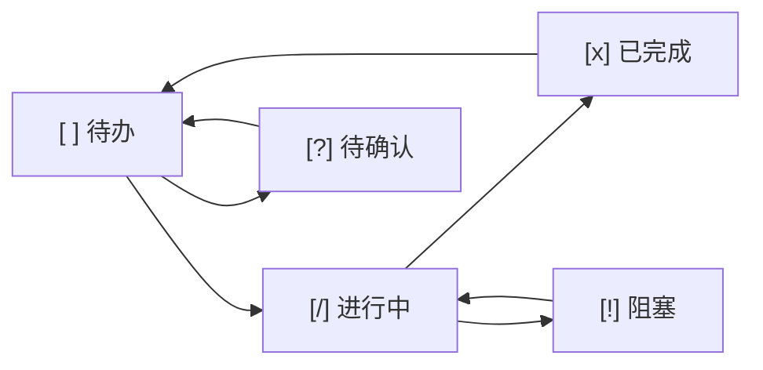

# Task Tracking Standards

> 本文件定义项目内任务追踪规范，确保进度透明、状态可追溯。

## 任务追踪文件位置 (MANDATORY)

- **主文件：** `docs/04-management/TASK_TRACKER.md`
- **任务详情：** 可在 `docs/04-management/tasks/` 下创建单任务详情文件

## 任务状态标识 (MANDATORY)

| 状态标识 | 含义 | 使用场景 |
|----------|------|----------|
| `[ ]` | 待办 | 任务已规划，尚未开始 |
| `[/]` | 进行中 | 任务正在执行 |
| `[x]` | 已完成 | 任务已完成，已验证 |
| `[!]` | 阻塞 | 任务遇到障碍，需外部干预 |
| `[?]` | 待确认 | 任务细节不明确，需澄清 |

## 任务记录格式 (MANDATORY)

```markdown
| ID | 任务描述 | 负责人 | 优先级 | 状态 | 关联需求 | 备注 |
|:----|:---------|:-------|:-------|:-----|:---------|:-----|
| T-001 | 实现用户登录功能 | Claude | P0 | [ ] 待办 | REQ-001 | 需配合 JWT |
```

**字段说明：**

| 字段 | 说明 | 格式要求 |
|------|------|----------|
| ID | 任务唯一标识 | T-NNN 格式，如 T-001 |
| 任务描述 | 简明扼要描述任务目标 | 不超过 30 字 |
| 负责人 | 任务执行者 | 具体人员名或 AI-Dev |
| 优先级 | 任务紧迫程度 | P0(紧急)/P1(高)/P2(中)/P3(低) |
| 状态 | 当前执行状态 | 使用标准状态标识 |
| 关联需求 | 关联的需求文档 ID | 如 REQ-001 |
| 备注 | 补充说明 | 可选，如阻塞原因、进度百分比 |

## 任务生命周期流程



## Claude Code 执行指令 (MANDATORY)

**开始任务时：**
- 先读取 `docs/04-management/TASK_TRACKER.md` 确认当前任务状态
- 更新状态为 `[/]` 进行中
- 确认任务详情后再开始实现

**任务执行中：**
- 遇到阻塞：立即更新状态为 `[!]` 阻塞，说明阻塞原因
- 需要澄清：更新状态为 `[?]` 待确认，列出需要确认的问题

**完成任务后：**
- 必须更新状态为 `[x]` 已完成
- 填写关联 Commit 或 PR 链接

**任务状态检查时机：**
- 每次开始工作时：检查当前任务状态
- 每次中断工作时：更新当前任务状态和进度
- 每次提交代码时：确认任务状态已更新

## 任务详情文件模板

对于复杂任务，可在 `docs/04-management/tasks/` 下创建详情文件：

```markdown
# T-001: [任务标题]

## 基本信息
- **关联需求**: REQ-001
- **优先级**: P0
- **负责人**: Claude
- **预计工时**: 2h

## 任务描述
[详细描述任务目标和背景]

## 实现计划
1. [子任务 1]
2. [子任务 2]
3. [子任务 3]

## 技术要点
- [关键技术点 1]
- [关键技术点 2]

## 验收标准
- [ ] [验收标准 1]
- [ ] [验收标准 2]

## 执行日志
- YYYY-MM-DD HH:MM: 开始执行
- YYYY-MM-DD HH:MM: 完成子任务 1
```

## 与现有规则集成

本规则与以下规则协作：
- development-workflow: 任务规划阶段使用 planner agent
- documentation: 文档归档规范