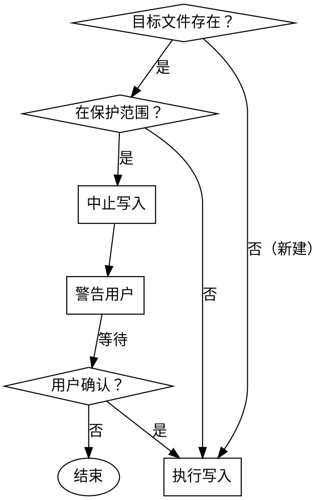
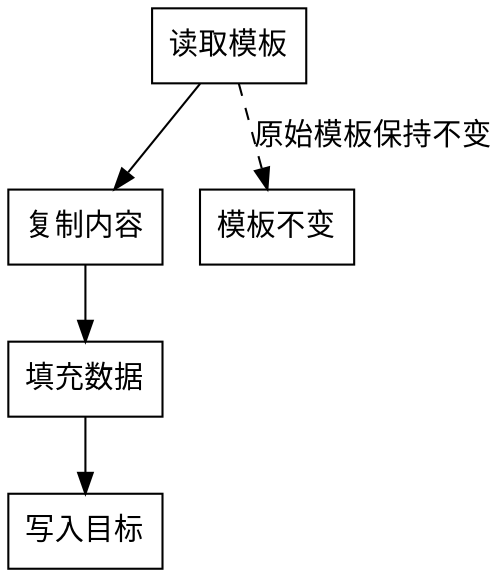

# Write Guard 安全规则

> 本规则定义自动写入的安全边界，防止 AI 覆盖用户数据。
> **优先级：MANDATORY** - 所有自动触发的 skills 必须遵守。

## 写入保护范围

### 禁止自动覆盖 (PROTECTED)

以下路径**禁止自动覆盖**，除非用户显式确认：

| 路径 | 原因 |
|------|------|
| `docs/**/*.md` | 已有文档可能包含重要内容 |
| `README.md` | 项目入口文档 |
| `CLAUDE.md` | Claude Code 指导文件 |

### 允许自动创建/更新 (SAFE)

以下路径**允许自动创建/更新**：

| 路径 | 用途 |
|------|------|
| `docs/DOC_INDEX.md` | 索引文件（自动生成） |
| `docs/04-management/TASK_TRACKER.md` | 任务追踪（自动更新） |
| `docs/04-management/CHANGELOG.md` | 变更日志（自动追加） |
| `.claude/cooldown-state.json` | 冷却状态（临时数据） |

## 写入前置检查

自动写入前必须执行以下检查流程：



### 检查代码示例

```javascript
function canWrite(filePath, rules) {
  // 1. 检查文件是否存在
  if (!fs.existsSync(filePath)) {
    return { allowed: true, reason: 'new_file' };
  }

  // 2. 检查是否在保护范围
  const protectedPaths = rules.protected;
  const isProtected = protectedPaths.some(p => filePath.match(p));

  if (isProtected) {
    return { allowed: false, reason: 'protected', needConfirm: true };
  }

  return { allowed: true, reason: 'safe_path' };
}
```

## 模板保护

### templates/ 目录规则

templates/ 目录下所有文件：

- **只读属性**：AI 不得直接修改模板文件
- **输出副本**：生成文档时复制模板内容到目标位置

### 模板使用流程



## 触发冷却机制

### 冷却规则

自动触发的 skill 必须遵守冷却时间：

| 配置项 | 值 |
|--------|-----|
| 冷却时间 | 3 秒（默认） |
| 冷却范围 | 同一文件 + 同一 skill |
| 状态存储 | `.claude/cooldown-state.json` |

### 防触发风暴

防止无限循环触发（如 doc-sync → 修改 doc → 再触发 doc-sync）：

```javascript
class CooldownGuard {
  constructor(cooldownSeconds = 3) {
    this.cooldownSeconds = cooldownSeconds;
    this.state = {};
  }

  canTrigger(filePath, skillName) {
    const key = `${filePath}:${skillName}`;
    const lastTrigger = this.state[key];

    if (!lastTrigger) {
      this.state[key] = Date.now();
      return true;
    }

    const elapsed = Date.now() - lastTrigger;
    if (elapsed >= this.cooldownSeconds * 1000) {
      this.state[key] = Date.now();
      return true;
    }

    return false; // 冷却中，拒绝触发
  }
}
```

## 用户确认机制

以下操作**必须**用户显式确认：

| 操作 | 确认方式 |
|------|----------|
| 覆盖已有文档 | 提示用户输入 Y/n |
| 删除文档 | 提示用户输入文件名确认 |
| 修改 CLAUDE.md | 提示用户预览变更内容 |

### 确认提示格式

```
⚠️  写入保护警告

目标文件已存在：docs/01-requirements/REQ-001.md
该文件在保护范围内，自动写入已中止。

文件当前内容摘要：
- [前 5 行内容]

是否继续写入？
  Y - 覆盖文件
  n - 取消操作
  v - 查看完整文件内容

请输入选择：
```

## 与 rule-binding.json 集成

write-guard 规则与 rule-binding.json 配合执行：

| skill | write-guard 检查点 |
|-------|-------------------|
| project-init | 检查 docs/ 目录是否已存在 |
| requirement-change | 检查 CHANGELOG.md 是否允许追加 |
| task-update | 检查 TASK_TRACKER.md 是否在安全范围 |
| doc-sync | 冷却检查 + 文件保护检查 |

## 版本兼容

write-guard.md 规则变更时：

- 必须更新 rule-binding.json 版本号
- 提供迁移指南（见 `docs/architecture/migration-strategy.md`）
- Breaking Changes 需用户确认