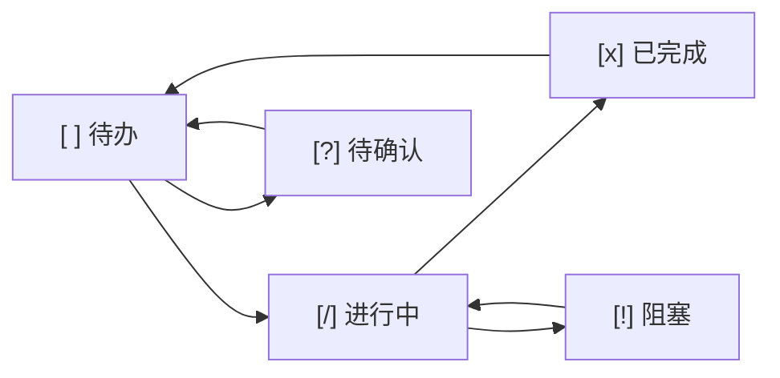
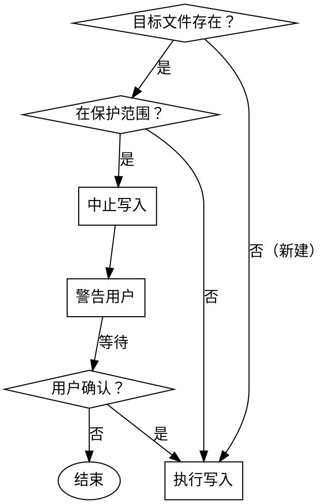
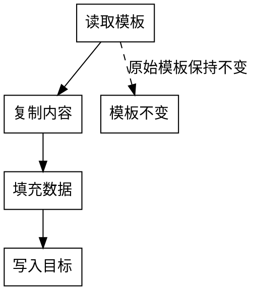

# Project-Doc for Gemini CLI

> This file integrates project-doc with Gemini CLI.
> Include relevant sections in your prompts.

---

## Overview

Project-Doc 是专为 AI 编程助手打造的项目治理专家。

**核心能力**：
- 文档自动化治理
- 任务状态追踪
- 需求变更追溯

---

## Rules

### documentation.md

# Documentation Standards

> 本文件定义项目文档归档规范，确保文档统一管理、易于追溯、AI 可理解。

## 文档目录结构 (MANDATORY)

所有项目文档必须按以下结构组织：

```
docs/
├── 01-requirements/     # 需求定义、PRD、用户故事
├── 02-design/           # 架构设计、API 设计、UI/UX、数据库设计
├── 03-technical/        # 环境搭建、部署手册、核心逻辑说明
├── 04-management/       # 会议纪要、变更追溯、任务追踪
├── 05-archive/          # 历史废弃版本
└── DOC_INDEX.md         # 文档总索引（入口）
```

**目录职责说明：**

| 目录 | 职责 | 典型文档 |
|------|------|----------|
| 01-requirements | 解决"做什么" | PRD、用户故事、业务流程图、产品路线图 |
| 02-design | 解决"怎么做" | 系统架构、API 规范、UI/UX 设计、数据库建模 |
| 03-technical | 解决"如何用" | 环境搭建、部署手册、Troubleshooting、核心算法说明 |
| 04-management | 解决"谁在做/改了什么" | 会议纪要、任务追踪、变更追溯 |
| 05-archive | 解决"历史记录" | 废弃的需求版本、过时的设计文档 |

## 文档命名规范 (MANDATORY)

**格式：** `[序号]_[类型简写]_[描述关键词]_[日期/版本].md`

**类型简写列表：**

| 简写 | 全称 | 用途 | 示例 |
|------|------|------|------|
| REQ | Requirement | 需求文档 | 01_REQ_UserAuth_v1.0.md |
| ARCH | Architecture | 架构设计 | 02_ARCH_SystemOverview.md |
| API | API Specification | API 接口规范 | 02_API_RestEndpoints.md |
| UI | UI/UX Design | UI/UX 设计 | 02_UI_LoginFlow.md |
| DB | Database | 数据库设计 | 02_DB_Schema.md |
| TECH | Technical | 技术文档 | 03_TECH_SetupGuide_Mac.md |
| MOM | Minutes of Meeting | 会议纪要 | 04_MOM_SprintPlanning_20231025.md |
| REVIEW | Review Report | Review 报告 | 04_REVIEW_CodeQuality.md |

**命名原则：**
- 唯一性：同一目录下文件名不重复
- 可排序：序号前缀确保按类型排序
- 可预测：通过命名即可判断文档类型和用途
- 无空格：使用下划线或连字符替代空格

## 文档总索引 (DOC_INDEX.md)

每个项目必须在 `docs/` 下维护 `DOC_INDEX.md`，作为文档入口。

**DOC_INDEX.md 必须包含：**
1. 项目名称和简介
2. 快速导航：链接到各目录下的核心文档
3. 命名与归档规范汇总
4. Claude Code 上下文读取指令

## 文档生命周期管理

| 生命周期阶段 | 操作 | 说明 |
|-------------|------|------|
| 新建 | 按分类存入对应目录 | 使用标准命名格式 |
| 更新 | 更新 DOC_INDEX.md 索引 | 确保索引与实际文件一致 |
| 版本升级 | 追加版本号或日期 | 如 v1.0 → v1.1 或追加日期 |
| 废弃 | 移动至 05-archive | 文件顶部标注 `[DEPRECATED]` 及废弃原因 |

## Claude Code 执行指令 (MANDATORY)

**代码变更前：**
- 必须先查阅 `docs/01-requirements/` 下的相关 PRD 或需求文档
- 确认需求理解正确后再开始实现

**功能完成后：**
- 同步更新 `docs/04-management/TASK_TRACKER.md` 任务状态
- 如涉及需求变更，记录到 `docs/04-management/CHANGELOG.md`

**新建项目时：**
- 使用 `/project-init` 技能创建标准文档目录结构
- 生成初始 `DOC_INDEX.md` 模板

## 文档质量检查清单

在提交代码前，检查文档状态：

- [ ] 新功能是否有对应需求文档
- [ ] 需求文档是否已链接到 DOC_INDEX.md
- [ ] 变更是否已记录到 CHANGELOG.md
- [ ] 任务状态是否已更新到 TASK_TRACKER.md
- [ ] 废弃文档是否已移动至 05-archive

---

### project-doc-integration.md

# Project-Doc Integration Rules

> 本文件定义 project-doc 插件与现有开发工作流的集成指令。
> 安装插件后自动生效，无需修改现有规则文件。

## 与 Development Workflow 集成

在执行 development-workflow 的各阶段时，同步执行以下指令：

### 阶段 0：Research & Reuse
- **无额外指令**，按现有规则执行

### 阶段 1：Plan First
**新增指令 (MANDATORY)：**
1. 使用 `/project-init` 技能创建标准文档目录结构
2. 将规划文档按 documentation.md 规范存放：
   - PRD → `docs/01-requirements/`
   - Architecture → `docs/02-design/`
   - Tech Doc → `docs/03-technical/`
3. 更新 `docs/DOC_INDEX.md` 索引

### 阶段 2：TDD Approach
**新增指令 (MANDATORY)：**
1. 开始编写测试前，先读取 `docs/01-requirements/` 下的相关需求文档
2. 确认测试覆盖的需求点

### 阶段 3：Code Review
**新增指令 (MANDATORY)：**
1. Review 时检查文档状态：
   - 新功能是否有需求文档支撑
   - 需求文档是否已链接到 DOC_INDEX.md

### 阶段 4：Commit & Push
**新增指令 (MANDATORY)：**
1. 更新 `docs/04-management/TASK_TRACKER.md` 任务状态
2. 如涉及需求变更，记录到 `docs/04-management/CHANGELOG.md`
3. 提交消息中引用任务 ID（如 `feat: add login (T-001)`）

## 与 Git Workflow 集成

在执行 git-workflow 时，同步执行以下指令：

### Commit Message Format
**扩展格式：**
```
<type>: <description> (TASK_ID)

<optional body>
```

示例：
```
feat: add user login feature (T-001)

- Implement JWT authentication
- Add login UI component

Relates: REQ-001, T-001
```

### Pull Request Workflow
**新增指令 (MANDATORY)：**
1. PR 描述中包含：
   - 关联需求 ID（如 `Relates: REQ-001`）
   - 任务 ID（如 `Task: T-001`）
   - 变更说明（如有需求变更）
2. PR 合并前检查文档更新状态

## 与 Agents 集成

在使用 agents 时，新增以下代理职责：

### planner agent
- 创建文档目录结构（调用 project-init 技能）
- 生成文档索引 DOC_INDEX.md

### code-reviewer agent
- 检查文档状态：需求文档是否存在、是否已归档
- 检查变更追溯：CHANGELOG.md 是否已更新

### doc-updater agent
- 更新 DOC_INDEX.md 索引
- 更新 TASK_TRACKER.md 任务状态
- 更新 CHANGELOG.md 变更记录

## 执行优先级

当本文件指令与现有规则冲突时：
- **本文件指令优先**（针对文档和任务管理的特定场景）
- 现有规则继续适用于非文档场景

## 自动触发机制

以下场景自动触发对应技能：

| 场景 | 自动触发技能 | 执行内容 |
|------|-------------|----------|
| 开始任务时 | task-update | 更新状态为 [/] 进行中 |
| 完成任务时 | task-update | 更新状态为 [x] 已完成，关联 Commit |
| 代码变更完成后 | doc-sync | 更新 DOC_INDEX.md，同步文档状态 |
| 需求变更发起时 | requirement-change | 创建变更记录（可选手动触发 /req-change） |

---

### task-tracking.md

# Task Tracking Standards

> 本文件定义项目内任务追踪规范，确保进度透明、状态可追溯。

## 任务追踪文件位置 (MANDATORY)

- **主文件：** `docs/04-management/TASK_TRACKER.md`
- **任务详情：** 可在 `docs/04-management/tasks/` 下创建单任务详情文件

## 任务状态标识 (MANDATORY)

| 状态标识 | 含义 | 使用场景 |
|----------|------|----------|
| `[ ]` | 待办 | 任务已规划，尚未开始 |
| `[/]` | 进行中 | 任务正在执行 |
| `[x]` | 已完成 | 任务已完成，已验证 |
| `[!]` | 阻塞 | 任务遇到障碍，需外部干预 |
| `[?]` | 待确认 | 任务细节不明确，需澄清 |

## 任务记录格式 (MANDATORY)

```markdown
| ID | 任务描述 | 负责人 | 优先级 | 状态 | 关联需求 | 备注 |
|:----|:---------|:-------|:-------|:-----|:---------|:-----|
| T-001 | 实现用户登录功能 | Claude | P0 | [ ] 待办 | REQ-001 | 需配合 JWT |
```

**字段说明：**

| 字段 | 说明 | 格式要求 |
|------|------|----------|
| ID | 任务唯一标识 | T-NNN 格式，如 T-001 |
| 任务描述 | 简明扼要描述任务目标 | 不超过 30 字 |
| 负责人 | 任务执行者 | 具体人员名或 AI-Dev |
| 优先级 | 任务紧迫程度 | P0(紧急)/P1(高)/P2(中)/P3(低) |
| 状态 | 当前执行状态 | 使用标准状态标识 |
| 关联需求 | 关联的需求文档 ID | 如 REQ-001 |
| 备注 | 补充说明 | 可选，如阻塞原因、进度百分比 |

## 任务生命周期流程



## Claude Code 执行指令 (MANDATORY)

**开始任务时：**
- 先读取 `docs/04-management/TASK_TRACKER.md` 确认当前任务状态
- 更新状态为 `[/]` 进行中
- 确认任务详情后再开始实现

**任务执行中：**
- 遇到阻塞：立即更新状态为 `[!]` 阻塞，说明阻塞原因
- 需要澄清：更新状态为 `[?]` 待确认，列出需要确认的问题

**完成任务后：**
- 必须更新状态为 `[x]` 已完成
- 填写关联 Commit 或 PR 链接

**任务状态检查时机：**
- 每次开始工作时：检查当前任务状态
- 每次中断工作时：更新当前任务状态和进度
- 每次提交代码时：确认任务状态已更新

## 任务详情文件模板

对于复杂任务，可在 `docs/04-management/tasks/` 下创建详情文件：

```markdown
# T-001: [任务标题]

## 基本信息
- **关联需求**: REQ-001
- **优先级**: P0
- **负责人**: Claude
- **预计工时**: 2h

## 任务描述
[详细描述任务目标和背景]

## 实现计划
1. [子任务 1]
2. [子任务 2]
3. [子任务 3]

## 技术要点
- [关键技术点 1]
- [关键技术点 2]

## 验收标准
- [ ] [验收标准 1]
- [ ] [验收标准 2]

## 执行日志
- YYYY-MM-DD HH:MM: 开始执行
- YYYY-MM-DD HH:MM: 完成子任务 1
```

## 与现有规则集成

本规则与以下规则协作：
- development-workflow: 任务规划阶段使用 planner agent
- documentation: 文档归档规范

---

### write-guard.md

# Write Guard 安全规则

> 本规则定义自动写入的安全边界，防止 AI 覆盖用户数据。
> **优先级：MANDATORY** - 所有自动触发的 skills 必须遵守。

## 写入保护范围

### 禁止自动覆盖 (PROTECTED)

以下路径**禁止自动覆盖**，除非用户显式确认：

| 路径 | 原因 |
|------|------|
| `docs/**/*.md` | 已有文档可能包含重要内容 |
| `README.md` | 项目入口文档 |
| `CLAUDE.md` | Claude Code 指导文件 |

### 允许自动创建/更新 (SAFE)

以下路径**允许自动创建/更新**：

| 路径 | 用途 |
|------|------|
| `docs/DOC_INDEX.md` | 索引文件（自动生成） |
| `docs/04-management/TASK_TRACKER.md` | 任务追踪（自动更新） |
| `docs/04-management/CHANGELOG.md` | 变更日志（自动追加） |
| `.claude/cooldown-state.json` | 冷却状态（临时数据） |

## 写入前置检查

自动写入前必须执行以下检查流程：



### 检查代码示例

```javascript
function canWrite(filePath, rules) {
  // 1. 检查文件是否存在
  if (!fs.existsSync(filePath)) {
    return { allowed: true, reason: 'new_file' };
  }

  // 2. 检查是否在保护范围
  const protectedPaths = rules.protected;
  const isProtected = protectedPaths.some(p => filePath.match(p));

  if (isProtected) {
    return { allowed: false, reason: 'protected', needConfirm: true };
  }

  return { allowed: true, reason: 'safe_path' };
}
```

## 模板保护

### templates/ 目录规则

templates/ 目录下所有文件：

- **只读属性**：AI 不得直接修改模板文件
- **输出副本**：生成文档时复制模板内容到目标位置

### 模板使用流程



## 触发冷却机制

### 冷却规则

自动触发的 skill 必须遵守冷却时间：

| 配置项 | 值 |
|--------|-----|
| 冷却时间 | 3 秒（默认） |
| 冷却范围 | 同一文件 + 同一 skill |
| 状态存储 | `.claude/cooldown-state.json` |

### 防触发风暴

防止无限循环触发（如 doc-sync → 修改 doc → 再触发 doc-sync）：

```javascript
class CooldownGuard {
  constructor(cooldownSeconds = 3) {
    this.cooldownSeconds = cooldownSeconds;
    this.state = {};
  }

  canTrigger(filePath, skillName) {
    const key = `${filePath}:${skillName}`;
    const lastTrigger = this.state[key];

    if (!lastTrigger) {
      this.state[key] = Date.now();
      return true;
    }

    const elapsed = Date.now() - lastTrigger;
    if (elapsed >= this.cooldownSeconds * 1000) {
      this.state[key] = Date.now();
      return true;
    }

    return false; // 冷却中，拒绝触发
  }
}
```

## 用户确认机制

以下操作**必须**用户显式确认：

| 操作 | 确认方式 |
|------|----------|
| 覆盖已有文档 | 提示用户输入 Y/n |
| 删除文档 | 提示用户输入文件名确认 |
| 修改 CLAUDE.md | 提示用户预览变更内容 |

### 确认提示格式

```
⚠️  写入保护警告

目标文件已存在：docs/01-requirements/REQ-001.md
该文件在保护范围内，自动写入已中止。

文件当前内容摘要：
- [前 5 行内容]

是否继续写入？
  Y - 覆盖文件
  n - 取消操作
  v - 查看完整文件内容

请输入选择：
```

## 与 rule-binding.json 集成

write-guard 规则与 rule-binding.json 配合执行：

| skill | write-guard 检查点 |
|-------|-------------------|
| project-init | 检查 docs/ 目录是否已存在 |
| requirement-change | 检查 CHANGELOG.md 是否允许追加 |
| task-update | 检查 TASK_TRACKER.md 是否在安全范围 |
| doc-sync | 冷却检查 + 文件保护检查 |

## 版本兼容

write-guard.md 规则变更时：

- 必须更新 rule-binding.json 版本号
- 提供迁移指南（见 `docs/architecture/migration-strategy.md`）
- Breaking Changes 需用户确认

---

## Skills

### doc-sync

---
name: doc-sync
description: Automatically triggered when documentation changes are detected - syncs DOC_INDEX.md after documents are added or archived
---

# Doc-Sync Skill

自动同步文档状态，更新 DOC_INDEX.md。由规则文件触发，无需手动调用。

## 触发条件

由 documentation.md 规则驱动：

| 触发时机 | 操作 |
|----------|------|
| 新增文档时 | 添加到 DOC_INDEX.md 快速导航 |
| 废弃文档时 | 移动至 05-archive，更新 DOC_INDEX.md |
| 功能完成时 | 检查文档状态是否需要更新 |

## 执行流程

1. **扫描 docs/ 目录**
   检查是否有新增或变更的文档

2. **更新 DOC_INDEX.md**
   - 新增文档：添加到对应分类的快速导航
   - 废弃文档：移动链接至"归档"部分

3. **检查文档完整性**
   - 新功能是否有需求文档
   - 需求文档是否已链接

4. **输出同步报告**
   列出更新的内容和检查结果

## 输出示例

```
📄 文档状态已同步

检查结果：
✅ 01-requirements/ 有 2 个文档
✅ 02-design/ 有 1 个文档
⚠️ REQ-002 未链接到 DOC_INDEX.md

已更新: docs/DOC_INDEX.md

建议操作：
- 将 REQ-002 链接添加到快速导航
```

---

### project-init

---
name: project-init
description: Use when the user asks to "initialize project docs", "create doc structure", "project-init", or starts a new project - creates standard documentation directory structure with templates
userInvocable: true
---

# Project-Init Skill

初始化项目的文档目录结构，创建标准归档体系。

## 参数

`/project-init [--lang zh|en]`

| 参数 | 值 | 说明 |
|------|-----|------|
| `--lang` | `zh` | 中文模板（默认） |
| `--lang` | `en` | 英文模板 |

**示例**：
- `/project-init` - 使用中文模板初始化
- `/project-init --lang en` - 使用英文模板初始化

## 执行流程

1. **解析参数**
   - 检测 `--lang` 参数
   - 默认值：`zh`（中文）

2. **确认项目路径**
   - 询问用户项目根目录位置（默认当前工作目录）

3. **选择模板目录**
   - 根据 `--lang` 参数选择：
     - `zh` → `templates/zh/`
     - `en` → `templates/en/`

4. **创建文档目录结构**
   ```
   docs/
   ├── 01-requirements/
   ├── 02-design/
   ├── 03-technical/
   ├── 04-management/
   │   └── tasks/
   ├── 05-archive/
   └── DOC_INDEX.md
   ```

5. **复制模板文件**
   - 从 `{lang}/DOC_INDEX.md` 复制到 `docs/DOC_INDEX.md`
   - 从 `{lang}/TASK_TRACKER.md` 复制到 `docs/04-management/TASK_TRACKER.md`
   - 从 `{lang}/CHANGELOG.md` 复制到 `docs/04-management/CHANGELOG.md`

6. **询问初始需求**
   - 是否需要创建初始需求文档？
   - 如需要，询问需求名称，使用 `{lang}/REQ_template.md` 生成 REQ-001

7. **输出完成报告**
   - 列出创建的目录和文件
   - 显示使用的语言模板
   - 提示用户下一步操作

## 使用方法

手动触发：
```
/project-init                  # 中文模板（默认）
/project-init --lang zh        # 中文模板
/project-init --lang en        # 英文模板
```

## 输出示例（中文）

```
✅ 项目文档结构已初始化

语言模板：中文 (zh)

创建的目录：
- docs/01-requirements/
- docs/02-design/
- docs/03-technical/
- docs/04-management/
- docs/04-management/tasks/
- docs/05-archive/

创建的文件：
- docs/DOC_INDEX.md
- docs/04-management/TASK_TRACKER.md
- docs/04-management/CHANGELOG.md

下一步：
1. 编辑 DOC_INDEX.md 填写项目名称和简介
2. 在 01-requirements/ 下创建需求文档
3. 使用 /req-change 管理需求变更
```

## 输出示例（英文）

```
✅ Project documentation structure initialized

Language template: English (en)

Created directories:
- docs/01-requirements/
- docs/02-design/
- docs/03-technical/
- docs/04-management/
- docs/04-management/tasks/
- docs/05-archive/

Created files:
- docs/DOC_INDEX.md
- docs/04-management/TASK_TRACKER.md
- docs/04-management/CHANGELOG.md

Next steps:
1. Edit DOC_INDEX.md to fill in project name and description
2. Create requirement documents in 01-requirements/
3. Use /req-change to manage requirement changes
```

## 与 runtime 集成

当通过 runtime 执行时，参数通过 inputContext 传入：

```javascript
{
  projectPath: '/path/to/project',
  lang: 'zh' // 或 'en'
}
```

runtime 会自动选择对应的模板目录并复制文件。

---

### requirement-change

---
name: requirement-change
description: Use when the user asks to "change requirement", "update requirement", "req-change", or needs to track requirement modifications - creates change records in CHANGELOG.md
---

# Requirement-Change Skill

管理需求变更，创建变更记录并更新 CHANGELOG.md。

## 执行流程

1. **收集变更信息**
   询问用户：
   - 关联需求 ID（如 REQ-001）
   - 变更原因
   - 影响评估（涉及哪些模块/文件）
   - 修改人

2. **生成变更 ID**
   格式：CR-NNN（如 CR-001）
   自动递增序号，基于 CHANGELOG.md 中现有记录

3. **更新 CHANGELOG.md**
   添加新行到变更追溯表：
   ```
   | CR-NNN | REQ-XXX | 变更原因 | 影响评估 | 修改人 | 待实施 | - |
   ```

4. **提示后续操作**
   - 变更实施后需更新状态和关联 Commit
   - 可创建变更详情文档（可选）

## 使用方法

手动触发：
```
/req-change
```

## 输出示例

```
✅ 需求变更已记录

变更 ID: CR-001
关联需求: REQ-001
变更原因: 增加手机号登录
影响评估: 需修改数据库 User 表
状态: 待实施

已更新: docs/04-management/CHANGELOG.md

后续操作：
1. 实施变更后，更新状态为"已实施"
2. 填写关联 Commit（如 feat: add mobile login #77）
```

---

### task-update

---
name: task-update
description: Automatically triggered when task status changes are detected - updates TASK_TRACKER.md status indicators ([ ] to [/], [/] to [x], etc.)
---

# Task-Update Skill

自动更新 TASK_TRACKER.md 中的任务状态。由规则文件触发，无需手动调用。

## 触发条件

由 task-tracking.md 规则驱动：

| 触发时机 | 操作 |
|----------|------|
| 开始任务时 | 更新状态为 `[/]` 进行中 |
| 完成任务时 | 更新状态为 `[x]` 已完成 |
| 任务阻塞时 | 更新状态为 `[!]` 阻塞 |
| 需澄清时 | 更新状态为 `[?]` 待确认 |

## 执行流程

1. **读取 TASK_TRACKER.md**
   定位目标任务行（通过任务 ID）

2. **更新状态字段**
   - 替换状态标识
   - 更新备注（如阻塞原因、进度百分比）

3. **更新关联 Commit**
   完成任务时，填写最近一次 Commit 或 PR 链接

4. **无需用户确认**
   自动执行，但输出更新内容供用户查看

## 状态转换规则

```
[ ] 待办 → [/] 进行中（开始任务）
[/] 进行中 → [x] 已完成（完成并验证）
[/] 进行中 → [!] 阻塞（遇到障碍）
[!] 阻塞 → [/] 进行中（障碍解除）
[ ] 待办 → [?] 待确认（细节不明确）
[?] 待确认 → [ ] 待办（已澄清）
[x] 已完成 → [ ] 待办（需要返工）
```

## 输出示例

```
📋 任务状态已更新

任务 ID: T-001
原状态: [ ] 待办
新状态: [/] 进行中
备注: 开始实现

已更新: docs/04-management/TASK_TRACKER.md
```

---

## Usage

在 Gemini CLI prompt 中引用相关部分：

```
Use project-doc project-init skill to initialize documentation structure.
```

---

Generated by project-doc v1.0.0
