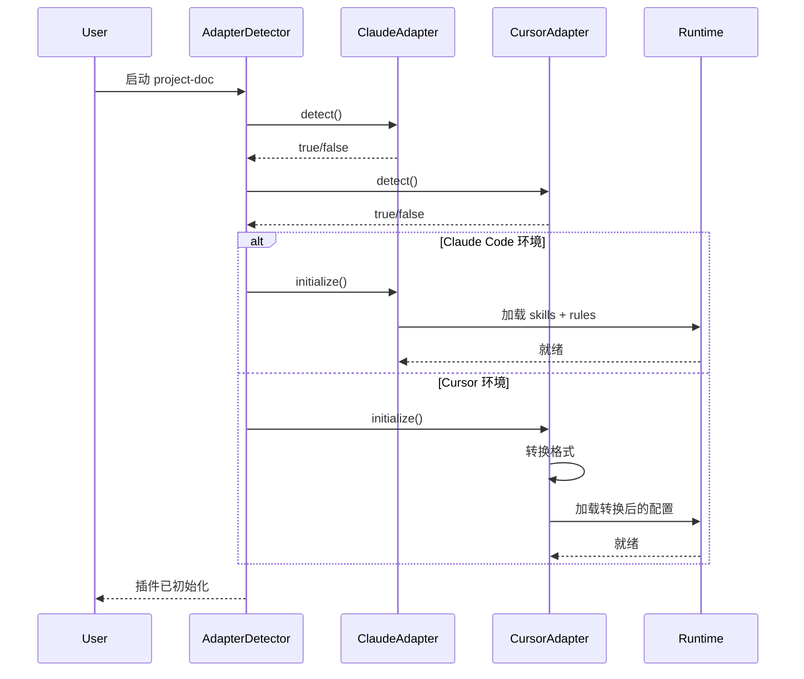

# Adapters 架构设计

> 本文档定义 project-doc 插件的多平台适配层架构。
> Phase 3 目标：支持 Claude Code、Cursor、OpenCode、Gemini CLI。

## 架构概述

```
┌─────────────────────────────────────────────────────────────┐
│                     project-doc 核心                          │
│                   (runtime + skills + rules)                  │
├─────────────────────────────────────────────────────────────┤
│                                                              │
│  ┌──────────────────────────────────────────────────────┐   │
│  │              adapters/ 适配层                          │   │
│  ├──────────────────────────────────────────────────────┤   │
│  │                                                      │   │
│  │  ┌─────────┐  ┌─────────┐  ┌─────────┐  ┌─────────┐ │   │
│  │  │ Claude  │  │ Cursor  │  │OpenCode │  │ Gemini  │ │   │
│  │  │ adapter │  │ adapter │  │ adapter │  │ adapter │ │   │
│  │  └─────────┘  └─────────┘  └─────────┘  └─────────┘ │   │
│  │          │          │          │          │          │   │
│  │          └──────────┴──────────┴──────────┘          │   │
│  │                          │                           │   │
│  │                          ▼                           │   │
│  │                 ┌─────────────┐                      │   │
│  │                 │  common/    │                      │   │
│  │                 │  interface  │                      │   │
│  │                 └─────────────┘                      │   │
│  └──────────────────────────────────────────────────────┘   │
│                                                              │
└─────────────────────────────────────────────────────────────┘
```

## 目录结构

```
adapters/
├── common/
│   ├── interface.js       → 共享接口定义
│   └── utils.js           → 共享工具函数
│
├── claude/
│   ├── adapter.js         → Claude Code 适配器
│   ├── plugin-format.js   → plugin.json 格式转换
│   └── skill-loader.js    → skill 加载逻辑
│
├── cursor/
│   ├── adapter.js         → Cursor IDE 适配器
│   ├── .cursor-plugin/    → Cursor 插件目录结构
│   └── rules-format.js    → Cursor rules 格式转换
│
├── opencode/
│   ├── adapter.js         → OpenCode 适配器
│   └── config-format.js   → OpenCode 配置格式
│
└── gemini/
│   ├── adapter.js         → Gemini CLI 适配器
│   └── GEMINI.md          → Gemini 扩展格式
│
└── index.js               → 适配器入口（自动检测平台）
```

## 共享接口定义（interface.js）

每个 adapter 必须实现以下接口：

```javascript
/**
 * Adapter Interface
 * 所有平台适配器必须实现此接口
 */
class AdapterInterface {
  /**
   * 平台名称
   * @returns {string}
   */
  getPlatformName() {}

  /**
   * 检测当前环境是否为此平台
   * @returns {boolean}
   */
  detect() {}

  /**
   * 注册 skill
   * @param {string} skillName
   * @param {object} skillConfig
   * @returns {boolean}
   */
  registerSkill(skillName, skillConfig) {}

  /**
   * 触发 skill
   * @param {string} skillName
   * @param {object} context
   * @returns {Promise<object>}
   */
  triggerSkill(skillName, context) {}

  /**
   * 加载规则文件
   * @param {string} rulePath
   * @returns {string} - 规则内容（可能需格式转换）
   */
  loadRule(rulePath) {}

  /**
   * 获取上下文
   * @returns {object} - { projectPath, currentFile, ... }
   */
  getContext() {}

  /**
   * 初始化插件
   * @param {string} pluginPath
   * @returns {boolean}
   */
  initialize(pluginPath) {}
}
```

## 平台差异分析

| 平台 | 插件目录 | 配置格式 | skill 触发 | rules 格式 |
|------|----------|----------|------------|------------|
| Claude Code | `.claude-plugin/` | `plugin.json` | `/skill-name` | `.md` 文件 |
| Cursor | `.cursor-plugin/` | `cursor.json` | 内置触发 | `.cursorrules` |
| OpenCode | `.opencode/` | `opencode.json` | 命令触发 | `.md` 文件 |
| Gemini CLI | 项目根目录 | `GEMINI.md` | prompt 引导 | 内嵌 markdown |

### Claude Code 特性

- **插件目录**：`.claude-plugin/plugin.json`
- **skill 触发**：用户输入 `/project-init`
- **rules 加载**：自动加载 `rules/*.md`
- **多 skill 支持**：`userInvocable` 区分手动/自动

### Cursor IDE 特性

- **插件目录**：`.cursor-plugin/` 或 `.cursorrules`
- **配置格式**：简化 JSON 或 `.cursorrules` 文件
- **skill 触发**：AI 自动识别规则
- **rules 格式**：单文件 `.cursorrules` 或多文件

**Cursor 转换策略**：
- 将 `rules/*.md` 合并为 `.cursorrules`
- 或保持多文件结构 `.cursor/rules/*.md`

### OpenCode 特性

- **插件目录**：`.opencode/`
- **配置格式**：`opencode.json`
- **skill 触发**：命令行参数
- **rules 格式**：类似 Claude Code

### Gemini CLI 特性

- **配置格式**：`GEMINI.md`（单文件）
- **skill 触发**：prompt 引导
- **rules 格式**：内嵌在 GEMINI.md

**Gemini 转换策略**：
- 将所有 rules 合并到 `GEMINI.md`
- 使用 markdown 格式分隔各规则

## 数据流图



## 自动平台检测逻辑

```javascript
// adapters/index.js
function detectPlatform() {
  // 1. 检查 Claude Code 特征
  if (fs.existsSync('.claude-plugin/plugin.json')) {
    return 'claude';
  }

  // 2. 检查 Cursor 特征
  if (fs.existsSync('.cursor-plugin/') || fs.existsSync('.cursorrules')) {
    return 'cursor';
  }

  // 3. 检查 OpenCode 特征
  if (fs.existsSync('.opencode/opencode.json')) {
    return 'opencode';
  }

  // 4. 检查 Gemini CLI 特征
  if (fs.existsSync('GEMINI.md')) {
    return 'gemini';
  }

  // 5. 默认 Claude Code
  return 'claude';
}

function getAdapter(platform) {
  switch (platform) {
    case 'claude':
      return new ClaudeAdapter();
    case 'cursor':
      return new CursorAdapter();
    case 'opencode':
      return new OpenCodeAdapter();
    case 'gemini':
      return new GeminiAdapter();
    default:
      return new ClaudeAdapter();
  }
}
```

## 格式转换策略

### rules → .cursorrules（Cursor）

```javascript
function convertRulesToCursorRules(rulesDir) {
  const rulesFiles = fs.readdirSync(rulesDir);
  let cursorRulesContent = '';

  rulesFiles.forEach(file => {
    const content = fs.readFileSync(path.join(rulesDir, file), 'utf8');
    cursorRulesContent += `## ${file}\n\n${content}\n\n---\n\n`;
  });

  fs.writeFileSync('.cursorrules', cursorRulesContent);
}
```

### rules → GEMINI.md（Gemini）

```javascript
function convertRulesToGeminiMd(rulesDir) {
  const rulesFiles = fs.readdirSync(rulesDir);
  let geminiContent = '# Project-Doc Rules\n\n';

  rulesFiles.forEach(file => {
    const content = fs.readFileSync(path.join(rulesDir, file), 'utf8');
    geminiContent += `## ${file}\n\n${content}\n\n`;
  });

  fs.writeFileSync('GEMINI.md', geminiContent);
}
```

## 错误处理

| 错误类型 | 处理方式 |
|----------|----------|
| 平台检测失败 | 默认使用 Claude adapter |
| 格式转换失败 | 保留原始格式，提示用户 |
| skill 注册失败 | 记录日志，继续其他 skills |

## 版本兼容

每个 adapter 独立版本：
- `adapters/claude/VERSION`
- `adapters/cursor/VERSION`
- `adapters/opencode/VERSION`
- `adapters/gemini/VERSION`

主版本号与 core 保持一致，副版本号可独立。

## 发布策略

| 平台 | 发布渠道 | 状态 |
|------|----------|------|
| Claude Code | 插件市场 | Phase 3 目标 |
| Cursor | GitHub + 手动安装 | Phase 3 支持 |
| OpenCode | GitHub + 手动安装 | Phase 3 支持 |
| Gemini CLI | GitHub + 手动安装 | Phase 3 支持 |

**npm 发布**：包含所有 adapters，用户按平台选择使用。