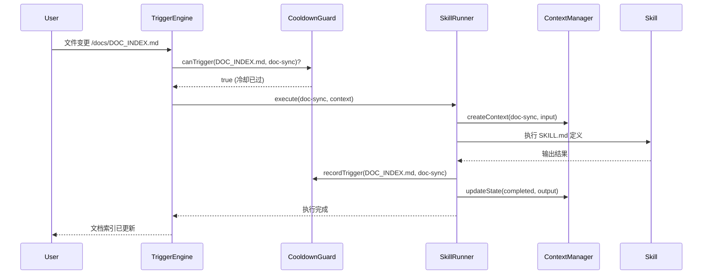

# Runtime 架构设计

> 本文档定义 project-doc 插件的 runtime 层架构。
> Runtime 将"静态配置系统"升级为"可执行 AI 系统"。

## 架构概述

```
┌─────────────────────────────────────────────────────────────┐
│                     Claude Code 环境                          │
├─────────────────────────────────────────────────────────────┤
│                                                              │
│  用户操作 ──────▶ TriggerEngine ──────▶ SkillRunner          │
│                     │                      │                 │
│  文件变更 ──────▶  │                      │                 │
│                     │                      ▼                 │
│  Lifecycle 事件 ──▶│              ContextManager            │
│                     │                      │                 │
│                     ▼                      ▼                 │
│              CooldownGuard          ───▶ Skills 执行         │
│                                                              │
└─────────────────────────────────────────────────────────────┘
```

## 目录结构

```
runtime/
├── index.js              → 入口文件（导出所有模块）
├── trigger-engine.js     → 触发引擎（监听 + 分发）
├── skill-runner.js       → Skill 执行器
├── context-manager.js    → 上下文管理
├── cooldown-guard.js     → 冷却守护（防触发风暴）
└── config.js             → 配置加载器
```

## 模块职责

### 1. TriggerEngine

**职责**：监听触发源，分发到对应的 skill。

**触发类型**：
| 类型 | 来源 | 实现 |
|------|------|------|
| manual | 用户输入 `/project-init` | Claude Code 内置 |
| file-change | 文件系统变更 | chokidar 监听 |
| lifecycle | 项目阶段事件 | Hook 机制 |

**核心接口**：

```javascript
class TriggerEngine {
  constructor(config, cooldownGuard) {
    this.config = config;
    this.cooldownGuard = cooldownGuard;
    this.watchers = {};
  }

  // 启动所有监听器
  start() { ... }

  // 停止所有监听器
  stop() { ... }

  // 分发触发事件
  dispatch(triggerType, context) { ... }

  // 注册监听器
  registerWatcher(triggerType, handler) { ... }
}
```

### 2. SkillRunner

**职责**：执行 skill，管理执行流程。

**执行流程**：

```
1. 加载 SKILL.md
2. 解析 rule-binding.json 获取关联规则
3. 加载规则文件
4. 检查 write-guard 安全边界
5. 执行 skill 逻辑
6. 输出结果
7. 更新 cooldown-state
```

**核心接口**：

```javascript
class SkillRunner {
  constructor(contextManager, ruleBindings) {
    this.contextManager = contextManager;
    this.ruleBindings = ruleBindings;
  }

  // 执行 skill
  async execute(skillName, inputContext) { ... }

  // 加载 skill 定义
  loadSkillDefinition(skillName) { ... }

  // 检查安全边界
  checkWriteGuard(filePath) { ... }

  // 获取关联规则
  getAppliedRules(skillName) { ... }
}
```

### 3. ContextManager

**职责**：管理执行上下文，保存/恢复状态。

**上下文结构**：

```javascript
{
  skillName: 'project-init',
  triggerType: 'manual',
  input: { projectPath: '/path/to/project', lang: 'zh' },
  timestamp: '2026-04-30T10:00:00Z',
  state: 'running', // pending | running | completed | failed
  output: null,
  error: null
}
```

**核心接口**：

```javascript
class ContextManager {
  constructor(storagePath) {
    this.storagePath = storagePath;
    this.contexts = {};
  }

  // 创建新上下文
  createContext(skillName, input) { ... }

  // 获取上下文
  getContext(contextId) { ... }

  // 更新上下文状态
  updateState(contextId, state, output) { ... }

  // 保存上下文到文件
  save(contextId) { ... }

  // 恢复上下文
  restore(contextId) { ... }
}
```

### 4. CooldownGuard

**职责**：防止触发风暴（无限循环）。

**冷却策略**：
- 同一文件 + 同一 skill 在冷却期内不重复触发
- 默认冷却时间：3 秒
- 最大冷却时间：30 秒

**核心接口**：

```javascript
class CooldownGuard {
  constructor(cooldownSeconds = 3) {
    this.cooldownSeconds = cooldownSeconds;
    this.state = {}; // filePath:skillName -> lastTriggerTime
  }

  // 检查是否可以触发
  canTrigger(filePath, skillName) { ... }

  // 记录触发
  recordTrigger(filePath, skillName) { ... }

  // 清理过期状态
  cleanup() { ... }

  // 从文件加载状态
  load(statePath) { ... }

  // 保存状态到文件
  save(statePath) { ... }
}
```

### 5. Config

**职责**：加载配置文件（plugin.json, rule-binding.json, trigger-spec.json）。

**核心接口**：

```javascript
class Config {
  constructor(pluginPath) {
    this.pluginPath = pluginPath;
  }

  // 加载所有配置
  loadAll() { ... }

  // 加载 plugin.json
  loadPlugin() { ... }

  // 加载 rule-binding.json
  loadRuleBindings() { ... }

  // 加载 trigger-spec.json
  loadTriggerSpec() { ... }

  // 验证配置一致性
  validate() { ... }
}
```

## 数据流图



## 与 Claude Code 集成

### 集成点

1. **启动入口**：runtime/index.js 作为 npm 包 main 入口
2. **Skill 触发**：Claude Code 通过 `/project-init` 调用 SkillRunner
3. **文件监听**：runtime 在后台运行 TriggerEngine

### 集成方式

```javascript
// Claude Code 调用示例
const { SkillRunner, Config } = require('project-doc/runtime');

const config = new Config('/path/to/plugin');
const runner = new SkillRunner(contextManager, config.ruleBindings);

// 手动触发
runner.execute('project-init', { projectPath: '/my/project', lang: 'zh' });
```

## 错误处理

| 错误类型 | 处理方式 |
|----------|----------|
| 配置文件缺失 | 抛出 ConfigError，提示用户检查安装 |
| Skill 执行失败 | 记录错误到 ContextManager，返回失败状态 |
| Write Guard 阻止 | 返回 ProtectedError，提示用户确认 |
| 触发风暴 | CooldownGuard 拦截，记录到 cooldown-state.json |

## 安全机制

1. **write-guard**：所有写入操作前检查保护范围
2. **cooldown-guard**：防止无限循环触发
3. **context isolation**：每次执行独立上下文
4. **error recovery**：失败后可恢复上下文重试

## 版本兼容

runtime 层与配置层版本独立：
- runtime 版本：`runtime/VERSION`
- 配置版本：`plugin.json` version 字段
- 迁移检查：Config.validate() 检查版本兼容性