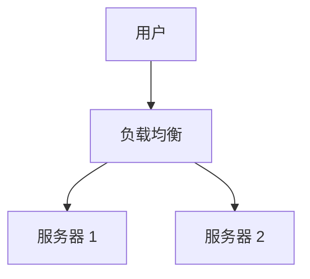

# ARCH-NNN: [架构设计标题]

## 基本信息
- **文档 ID**: ARCH-NNN
- **创建日期**: YYYY-MM-DD
- **负责人**: [负责人姓名]

## 系统概述

[描述系统的整体架构和核心组件]

## 技术栈选型

| 技术领域 | 选型 | 理由 |
|:---------|:-----|:-----|
| 后端框架 | [框架名称] | [选型理由] |
| 数据库 | [数据库名称] | [选型理由] |

## 核心组件设计

### 组件 1: [组件名称]
- **职责**: [组件职责]
- **接口**: [关键接口]

## 数据流图

## 部署拓扑

## 关联文档

- 需求文档: [链接]
- API 规范: [链接]