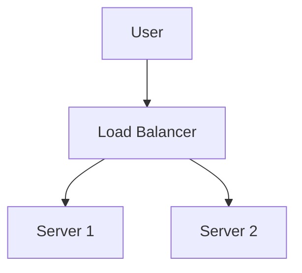

# ARCH-NNN: [Architecture Design Title]

## Basic Information
- **Document ID**: ARCH-NNN
- **Created**: YYYY-MM-DD
- **Owner**: [Owner Name]

## System Overview

[Describe the overall architecture and core components]

## Technology Stack

| Domain | Choice | Reason |
|:---------|:-----|:-----|
| Backend Framework | [Framework Name] | [Selection Reason] |
| Database | [Database Name] | [Selection Reason] |

## Core Component Design

### Component 1: [Component Name]
- **Responsibility**: [Component Responsibility]
- **Interface**: [Key Interfaces]

## Data Flow Diagram

## Deployment Topology

## Related Documents

- Requirement Document: [Link]
- API Specification: [Link]